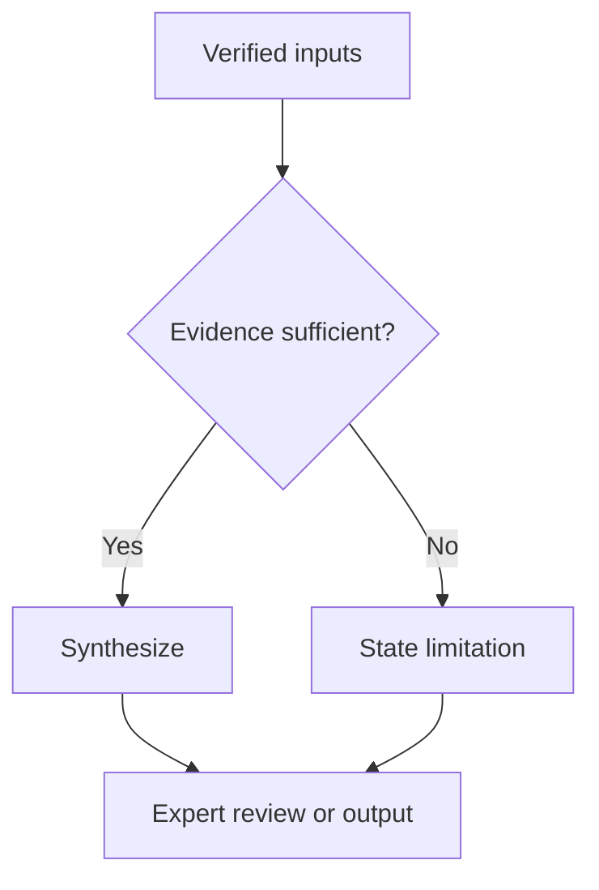

# Document production

Use this guide to turn approved scientific content into concise Markdown structures and a validated DOCX. Keep Markdown as the canonical editable source.

## Choose the clearest form

- Use prose for a short explanation or integrated reasoning.
- Use a table for repeated fields, comparisons, thresholds/actions, evidence matrices, or timelines.
- Use a workflow for three or more dependent steps, decisions, retries, or state changes.
- Use fenced blocks only when literal structure matters: code, commands, equations, pseudocode, JSON, YAML, schemas, or report examples.

## Tables

Build each table around one question. Use informative headers, parallel grammar, and consistent vocabulary. One cell should normally contain one result plus one essential qualifier; move extended methods, exceptions, and interpretation into a note.

Useful patterns include:

| Purpose | Useful columns |
|---|---|
| Evidence summary | Claim; source; main finding; applicability; limitation |
| Clinical/technical rationale | Domain; evidence; interpretation; uncertainty; action/review |
| Model comparison | Model/data; comparator; metric; result; validation; limitation |
| Decision rule | Condition; interpretation; action; exception/review |

State shared units in headers, explain abbreviations below the table, and cite the claim-bearing cell or introductory sentence. Preserve `not available`, `not assessed`, `not detected`, and `not applicable` as distinct states. Split a table rather than filling it with paragraph-length cells.

Write a caption once, immediately above the table, as `Table 1. Concise description.` or, when a citation is warranted, `Table 2. Thresholds adapted from the guideline.[1]` The renderer applies the Word Caption style and preserves the citation style. Default to one sentence and no more than roughly 35 words. Identify what the table shows and only the essential population, setting, time point, or unit; move methods, abbreviations, caveats, and interpretation into a table note or nearby prose.

Cite the direct source in the caption when a table is adapted, modified, or reproduced, or when the caption itself makes an externally supported claim. When rows or cells come from different sources, cite those cells instead of collecting unrelated citations in the caption. A caption describing original local results does not need an external citation unless it adds an external claim. Never cite a source that did not provide the attributed content.

## Structured blocks and workflows

Add a language label to every fenced block. Make placeholders visibly different from actual study or case values. Do not use code blocks merely to place a border around prose.

Use Mermaid for branching workflows:

Use actions for process nodes, questions for decisions, and labels for every branch. Show meaningful failure, unavailable-data, stop, and review routes. Put citations in the accompanying sentence or figure note, not inside Mermaid nodes. Confirm that prose, tables, structured blocks, and workflows express the same states and outcomes.

## Image formats

Keep PNG for plots, diagrams, screenshots, and text. Use JPEG only for photographic images when lossy compression is acceptable; do not convert diagnostic images, masks, or line art merely to reduce file size.

## Render to DOCX

The bundled renderer supports headings, paragraphs, blockquotes, basic lists, inline emphasis/code/simple mathematics, links, numeric citations, concise cited captions above pipe tables, fenced blocks, Mermaid, local PNG/JPEG images, and numbered references.

It does not create live Zotero fields, tracked changes, footnotes/endnotes, complex Word equations, merged Markdown table cells, or remote-image downloads. Use a specialized pipeline when those features are essential.

Use the standardize → strict-validation → render pipeline listed in `SKILL.md`.

Profiles:

- `nature`: Times New Roman, static superscript citations, three-line tables; default.
- `scientific`: Times New Roman, bracketed citations, three-line tables.
- `clinical`: Arial with compact grid tables.
- `supervisor`: Aptos with a presentation-oriented layout.

Options can override font, size, citation/table style, orientation, or a clean DOCX template. Mermaid `auto` renders when possible and otherwise preserves the source as code with a warning; use `--mermaid render` to fail instead. Existing outputs require explicit `--force` to replace.

## Final check

Verify that headings, tables, figures, code, citations, and references are present; each table caption is concise, appears once above its table, and cites only the sources that support its content; wide tables are legible; citation markers still support the same claims; code indentation is preserved; diagram branches match the source; no fallback warning was missed; and Word or LibreOffice opens the file. Structural validation cannot establish scientific truth or translation fidelity.
